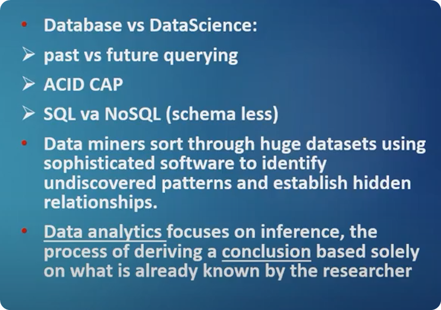
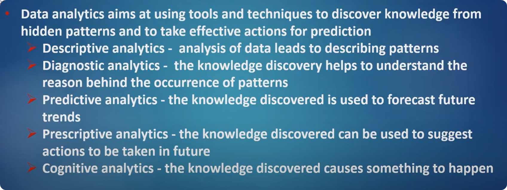
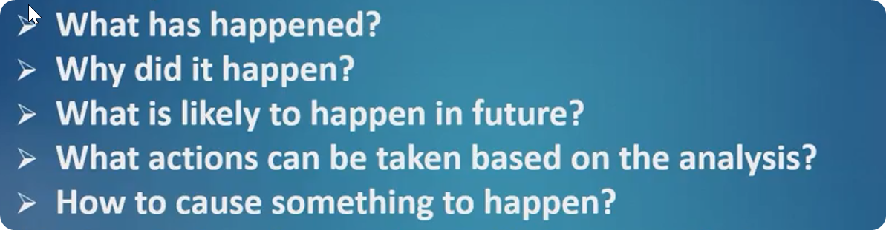
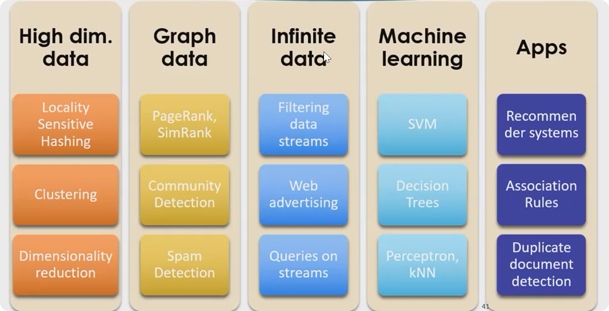
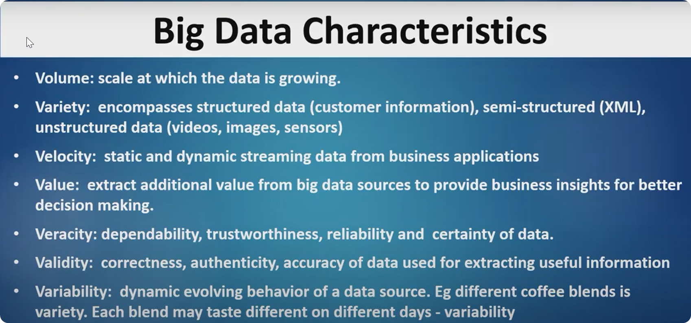

# Lecture 1

Business Intelligence

Data Mining is the transformation of data to information and information to knowledge

Data analysis two framework 
hadoop and spark  --> NOSQL 

Lecture 2
### Challenge and 3 Vs
Structured 
Semi - structured
Unstructured

ACID -->
atomicity, consistency, isolation, and durability

Descriptive Analytics (Methods)
Human interpretable patterns to describe data
**What has happened**
Example: Clustering, classification

Predictive Methods
Use some variables to preduct future values of other values
**what could happen**
Eg. Weather Station; Recommender Systems

Prescriptive Analytics
Enable smart decisions based on data; **what should we do**

| Analytics  | Question |
|---|---|
| | |

